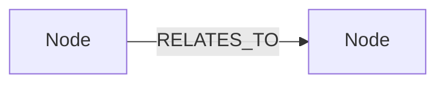
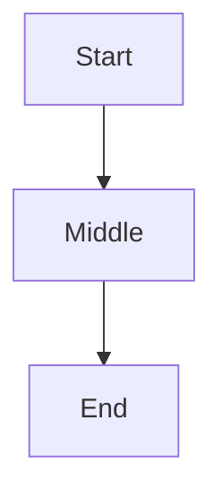

# Chapter Generator

Generate a single tutorial chapter from a structured specification. Produces Markdown files with MkDocs-compatible formatting (admonitions, fenced code blocks, mermaid diagrams).

## When to Use

- Generating a single tutorial chapter from a spec
- Creating MkDocs-compatible Markdown tutorials
- Producing educational content following aegir voice principles

## Trigger Phrases

- "Generate chapter [N] from the outline"
- "Create the tutorial for [chapter title]"
- "Write chapter [N] following the spec"
- "/chapter-gen [spec-path-or-inline]"

---

## Required Input

The skill expects a chapter specification with these fields:

```yaml
chapter:
  number: "N.M"
  title: "[Chapter Title]"
  depth: deep  # or light

  opening_hook: |
    [The war story or scenario]

  learning_objectives:
    - "[Objective 1]"
    - "[Objective 2]"

  aha_moments:
    - "[Aha 1]"

  key_queries:
    - description: "[What this demonstrates]"
      code: "[The code/query]"
      expected: "[Expected result]"

  closing_bridge: |
    [Transition to next chapter]

  visual_hooks:
    - type: "[mermaid|table|code_output|bar_chart]"
      description: "[What it shows]"

  falsifiable_claim:
    statement: "[Testable claim]"
    test: "[Verification method]"

  jargon_introduced:
    - term: "[Term]"
      earned_by: "[Intuition before naming]"
```

---

## Generation Process

### Phase 1: Structure

Create the file skeleton:

```markdown
---
title: "[Title]"
---

# [Title]

---
```

### Phase 2: Narrative Opening

Write the opening hook following story-first principles:

1. Drop the reader into a concrete scenario
2. Show something broken, surprising, or tension-creating
3. Include code if applicable (show the failing attempt)
4. Let the reader feel the wrongness before offering the fix

The opening must NOT start with "In this chapter..." or any abstract framing. It must start with a situation.

### Phase 3: Content Sections

For each learning objective, follow this pattern:

1. **Recap** (2-3 sentences): Where we are, what we have, what's next
2. **Scenario**: Concrete example motivating the concept
3. **Code block**: The query/code to try (fenced with language tag)
4. **Expected output**: What they should see (formatted as code output or table)
5. **Aha moment**: The insight that lands AFTER the buildup
6. **Bridge**: Transition to next concept

For `deep` chapters: give each objective full treatment with detailed scenarios and buildup.

For `light` chapters: compress the pattern. Faster transitions, less buildup, keep momentum.

### Phase 4: Exercises

**If `depth: deep`:**
- Include 2-3 exercises with:
  - Problem statement (what to figure out)
  - Hints (for early chapters)
  - Solution in a collapsible admonition
  - Verification (expected output)

**If `depth: light`:**
- Include 1 quick exercise or skip entirely

Exercise format for MkDocs:

```markdown
### Exercise: [Title]

[Problem statement]

??? tip "Hint"
    [Hint text]

??? success "Solution"
    ```cypher
    [Solution code]
    ```

    Expected output: [result]
```

### Phase 5: Closing

1. **"What You Learned" summary**: 3-5 bullet points
2. **Bridge to next chapter**: The open question that creates pull
3. **"Next Up" link**: Title and one-line teaser

```markdown
## What You Learned

- [Bullet 1]
- [Bullet 2]
- [Bullet 3]

## Next Up

**[Next Chapter Title]**: [One-line teaser that creates curiosity]
```

### Phase 6: Visual Hooks

Insert visual hooks every 2-3 sections. Never go more than 3 sections without something visual.

**Mermaid diagrams** (for graph structures, flows):
````markdown

````

**Code output descriptions** (for query results):
```markdown
| name | description | degree |
|------|-------------|--------|
| Properties | Core mechanism | 23 |
| Encapsulation | Abstract goal | 8 |
```

**Admonition callouts** (for insights, warnings):
```markdown
!!! info "The Insight"
    [Key takeaway formatted as a callout]
```

---

## MkDocs Formatting Reference

### Admonitions

```markdown
!!! note "Title"
    Content here.

!!! warning "Watch Out"
    Content here.

!!! tip "Try This"
    Content here.

!!! info "Key Insight"
    Content here.
```

### Collapsible admonitions (for solutions)

```markdown
??? success "Solution"
    Content hidden by default.

???+ note "Expanded by Default"
    Content visible but collapsible.
```

### Code blocks

Always use fenced code with language tags:

````markdown
```cypher
MATCH (c:Concept) RETURN c.name
```

```python
result = graph.run("MATCH (c:Concept) RETURN c.name")
```
````

### Mermaid diagrams

````markdown

````

---

## Phase 7: Screenshot Placeholders

After generating a chapter, insert HTML comment placeholders wherever a screenshot or visual capture should appear. Another agent (or human) will fill these in on a second pass.

### Comment Format

```markdown
<!-- SCREENSHOT: [description of what to capture] -->
```

### Placement Rules

Insert a screenshot placeholder:

1. **After every query result** (code output table or description): capture the Memgraph Lab or terminal output
2. **After mermaid diagrams**: capture the rendered graph visualization from Memgraph Lab (the live graph, not the mermaid render)
3. **After key "aha" moments**: capture the query + result that reveals the insight
4. **At the opening hook**: if the hook involves running a query, capture the surprising/broken result
5. **For exercise verification**: capture the expected output so readers can compare

### Examples

After a query result:
```markdown
| name | connections |
|------|------------|
| Properties | 23 |
| Encapsulation | 8 |

<!-- SCREENSHOT: Memgraph Lab query result showing degree counts, sorted descending -->
```

After a mermaid diagram (to supplement with a real graph view):
```markdown
` ``mermaid
graph LR
    A[DangerousSetters] -->|CHALLENGES| B[Encapsulation]
` ``

<!-- SCREENSHOT: Memgraph Lab graph view of DangerousSetters neighborhood, expanded 1 hop -->
```

At an aha moment:
```markdown
Properties has 23 connections. Encapsulation has 8. The most connected concept is not the one you expected.

<!-- SCREENSHOT: Memgraph Lab bar chart or query result showing Properties at the top of the degree list -->
```

### Description Guidelines

The description inside each placeholder should be specific enough for another agent to:
- Know which query to run (or reference the nearest code block)
- Know which tool to capture from (Memgraph Lab, terminal, browser)
- Know what the screenshot should emphasize (highlight, zoom, filter)

Good: `<!-- SCREENSHOT: Memgraph Lab graph view after running the MATCH (c:Concept)-[r]-() query, showing the DangerousSetters cluster -->`

Bad: `<!-- SCREENSHOT: graph view -->`

---

## Voice Principles (Summary)

See `reference/voice-guide.md` for the full guide. Key rules:

1. **Story-first**: Open with incident, not abstraction
2. **Code-before-formula**: Compute it, verify it, name it
3. **Recap aggressively**: Assume reader forgot 3 sections ago
4. **Jargon-earning**: Never use a term before earning it
5. **Personality**: Irreverent, direct, "you absolute walnut" energy when appropriate
6. **No em-dashes**: Use colons, commas, parentheses
7. **Visual every 2-3 sections**: Never go long without something to look at
8. **Falsifiable claims**: Include a testable claim per chapter
9. **Bridges**: Every chapter closes with pull toward the next

---

## Bragi Prose Cleanup (Anti-LLM Patterns)

After generating a chapter, run a prose quality pass. Scan for and fix these 9 patterns:

| Pattern | Detection | Fix |
|---------|-----------|-----|
| Em-dash usage | Any `—` | Colons, semicolons, commas, parentheses |
| Dismissive 'with' framing | "A demo with persistence" | Give the feature its own sentence weight |
| Tricolon/five-item enumerations | "fast, reliable, scalable" | Keep only items that earn their place |
| Performative honesty | "Being honest:", "To be frank:" | Delete the preamble |
| Self-referential pivot | "This is where X diverges..." | Make the point without announcing it |
| Punchy fragment marketing copy | Sentence fragments as slogans | Complete the sentence with a concrete claim |
| Colon-into-bold-statement | "The question: **...**" | Integrate into paragraph flow |
| Rhythmic parallel closers | Participial phrase chains | End with one concrete, specific claim |
| Hedging with 'not' lists | "Not X. Not Y. Not Z." | Say what it IS |

The goal is to strip LLM packaging while keeping substance and the author's voice (irreverent, direct, story-driven).

---

## Quality Checklist

- [ ] Opens with story/hook, not abstract framing
- [ ] Code blocks have language tags
- [ ] Aha moments land AFTER building intuition (not front-loaded)
- [ ] Visual hook every 2-3 sections (mermaid, table, code output, admonition)
- [ ] Jargon introduced only after earning through examples
- [ ] Closing bridges to next chapter with pull
- [ ] Exercises have solutions (if deep chapter)
- [ ] No em-dashes anywhere in the file
- [ ] Personality shows through (irreverent voice, not corporate)
- [ ] Falsifiable claim is present and testable
- [ ] Recap at the start of each major section
- [ ] MkDocs admonitions used correctly (`!!!`, `???`)
- [ ] Mermaid diagrams render (proper fencing)
- [ ] Bragi prose cleanup pass applied (9 anti-LLM patterns checked)
- [ ] Screenshot placeholders inserted (after query results, mermaid diagrams, aha moments)
- [ ] Each placeholder has a specific, actionable description
